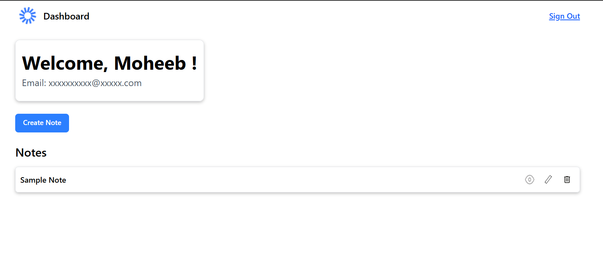

# 🔗 Note App

A note application built with **Node.js**, **Express**, and **MongoDB**. It allows users to create, edit, and delete notes—all in a simple and clean web interface.

## 🚀 Features

- 🔐 User authentication (session-based with JWT)
- ✂️ Create, Edit, Delete Notes
- 🧑‍💼 User profile to manage and view account
- 🧑‍💼 User dashboard to manage notes
- 💾 MongoDB for data persistence

---

## 🛠️ Tech Stack

- **Frontend**: React.js, React Router, Redux and TypeScript
- **Backend**: Node.js and Express.js
- **Database**: MongoDB with Mongoose
- **Authentication**: Hybrid Authentication using JWT + Argon + Cookies + MongoDb
- **OAuth**: Google using Arctic
- **Styling**: Tailwind CSS
- **Email**: Nodemailer + Brevo SMTP Server

---

## ⚙️ Installation

1. **Clone the repository**
   ```bash
   git clone https://github.com/moheebk123/Note-App.git
   cd Note-App
   ```

2. **Install dependencies**
- Go to **client** and **server** directory separately and run the below command:
   ```bash
   npm i
   or
   npm install
   ```


3. **Setup Brevo Account for SMTP Server**


4. **Initialize OAuth Apps on Google OAuth Provider**

5. **Set up environment variables**

- Create a **.env** file in the **client** directory:
   ```bash
   BACKEND_URL=YOUR-BACKEND-URL
   ```

- Create a **.env** file in the **server** directory:
   ```bash
   PORT=YOUR-PORT
  MONGODB_URI=YOUR-MONGODB-URI
  ORIGIN=YOUR-ORIGIN / http://localhost:YOUR-PORT
  MONGODB_DB_NAME=YOUR-MONGODB-DATABASE-NAME
  JWT_SECRET=YOUR-JWT-SECRET
  JWT_REFRESH_SECRET=YOUR-JWT-REFRESH-TOKEN-SECRET
  SMTP_USER=YOUR-SMTP-USER-OF-BREVO
  SMTP_PASSWORD=YOUR-SMTP-PASSWORD-OF-BREVO
  SENDER_EMAIL=YOUR-SMTP-SENDER-EMAIL-OF-BREVO
  SMTP_HOST=YOUR-SMTP-HOST-OF-BREVO
  SMTP_PORT=YOUR-SMTP-PORT-OF-BREVO
  GOOGLE_CLIENT_ID=YOUR-GOOGLE-OAUTH-CLIENT-ID
  GOOGLE_CLIENT_SECRET=YOUR-GOOGLE-OAUTH-CLIENT-SECRET
   ```

6. **Run the app**

- Go to **client** directory and run the below command:
   ```bash
   npm run dev
   ```

- Go to **server** directory and run the below command:
   ```bash
   npm start
   ```

---

## ✨ Screenshots
- **Register Page**

- **Login Page**

- **Dashboard**

- **Profile Page**


---

## 🧑 Author

Developed with ❤️ by **Moheeb Khan**

---